# Database

## Purpose

Define database entities, relationships, indexes, constraints, audit strategy, migration policy, and tenant isolation rules.

## Status

Stage 10 invitations and members. Identity, workspace, auth, and invitation foundations exist locally; later product tables are still intentionally deferred.

## Core Rules

- PostgreSQL is the source of truth for server data.
- Every workspace business table includes `workspace_id`.
- Global identity tables such as `users` do not include `workspace_id`.
- Join tables that represent workspace work include `workspace_id` even when it can be inferred.
- All mutable business tables include `id`, `created_at`, `updated_at`, `created_by`, `updated_by`, `deleted_at`, and `version` unless explicitly noted.
- Soft delete uses `deleted_at`.
- `version` is a monotonically increasing integer used for optimistic concurrency and sync conflict detection.
- IDs should be UUIDs generated by the application or database.
- All timestamps are stored in UTC.

## Common Columns

For workspace-scoped mutable entities:

| Column | Type | Rule |
| --- | --- | --- |
| `id` | uuid | Primary key |
| `workspace_id` | uuid | Required FK to `workspaces.id` |
| `created_at` | timestamptz | Required, UTC |
| `updated_at` | timestamptz | Required, UTC |
| `created_by` | uuid nullable | FK to `users.id`; nullable for system/import jobs |
| `updated_by` | uuid nullable | FK to `users.id`; nullable for system/import jobs |
| `deleted_at` | timestamptz nullable | Soft delete marker |
| `version` | integer | Required, starts at 1 |

## ERD

```mermaid
erDiagram
  User ||--o{ Session : has
  User ||--o{ Device : uses
  User ||--o{ WorkspaceMember : joins
  Workspace ||--o{ WorkspaceMember : contains
  Workspace ||--o{ Invitation : issues
  Workspace ||--o{ Team : owns
  Workspace ||--o{ PlayerProfile : owns
  Workspace ||--o{ CoachProfile : owns
  Role ||--o{ WorkspaceMember : assigned
  Role ||--o{ Permission : grants
  User ||--o| PlayerProfile : may_have
  User ||--o| CoachProfile : may_have
  Team ||--o{ TeamMember : has
  PlayerProfile ||--o{ TeamMember : joins
  Workspace ||--o{ DailySchedule : plans
  RoutineTemplate ||--o{ RoutineItem : contains
  PlayerProfile ||--o{ HabitAssignment : receives
  Habit ||--o{ HabitAssignment : assigned
  HabitAssignment ||--o{ HabitLog : logs
  PlayerProfile ||--o{ Goal : has
  Goal ||--o{ GoalProgress : records
  PlayerProfile ||--o{ WellnessCheck : submits
  PlayerProfile ||--o{ PainRecord : reports
  Exercise ||--o{ ExerciseMedia : has
  TrainingPlan ||--o{ TrainingSession : contains
  TrainingSession ||--o{ TrainingExercise : contains
  TrainingExercise ||--o{ ExerciseResult : produces
  TrainingSession ||--o{ Attendance : tracks
  Assessment ||--o{ AssessmentResult : records
  Workspace ||--o{ Task : owns
  Workspace ||--o{ Reminder : owns
  Workspace ||--o{ Notification : owns
  Workspace ||--o{ Message : owns
  Workspace ||--o{ File : owns
  Workspace ||--o{ ActivityLog : records
  Workspace ||--o{ SyncOperation : receives
  Plan ||--o{ Subscription : selected_by
  Workspace ||--o{ Subscription : subscribes
  Subscription ||--o{ Payment : bills
  Workspace ||--o{ ImportJob : imports
  Workspace ||--o{ ExportJob : exports
  Workspace ||--o{ BackupRecord : backs_up
```



## Entity Catalog

### User

Global identity.

Fields:

- `id`, `email`, `email_normalized`, `password_hash`, `email_verified_at`, `name`, `avatar_file_id`, `status`, `default_locale`, `default_timezone`, `default_calendar`, `default_hour_format`, `created_at`, `updated_at`, `deleted_at`, `version`

Constraints:

- Unique `email_normalized`.
- Email verification nullable and not required for MVP login.

Indexes:

- `users_email_normalized_idx`.
- `users_status_idx`.

### Session

Secure database session.

Fields:

- `id`, `user_id`, `device_id`, `token_hash`, `expires_at`, `revoked_at`, `last_seen_at`, `ip_hash`, `user_agent`, `created_at`

Constraints:

- Unique `token_hash`.

Indexes:

- `sessions_user_id_idx`.
- `sessions_token_hash_idx`.
- `sessions_expires_at_idx`.

### Device

Known browser/device record.

Fields:

- `id`, `user_id`, `label`, `fingerprint_hash`, `last_seen_at`, `created_at`, `updated_at`, `revoked_at`

Indexes:

- `devices_user_id_idx`.

### Workspace

Tenant boundary.

Fields:

- `id`, `name`, `slug`, `country`, `timezone`, `default_locale`, `default_calendar`, `default_hour_format`, `theme`, `activity_type`, `approx_player_count`, common columns without `workspace_id`

Constraints:

- Unique `slug`.

Indexes:

- `workspaces_slug_idx`.

### WorkspaceMember

User membership in a workspace.

Fields:

- `id`, `workspace_id`, `user_id`, `role_id`, `status`, `joined_at`, `invited_by`, `team_scope_mode`, `player_scope_mode`, common columns

Constraints:

- Unique active membership on `(workspace_id, user_id)` where `deleted_at is null`.

Indexes:

- `workspace_members_workspace_user_idx`.
- `workspace_members_workspace_role_idx`.
- `workspace_members_status_idx`.

### Role

Workspace role definition.

Fields:

- `id`, `workspace_id nullable`, `key`, `name`, `description`, `is_system`, common columns

System role keys:

- `owner`, `coach`, `assistant`, `player`

Constraints:

- Unique `(workspace_id, key)` for workspace roles.
- Unique `key` where `workspace_id is null` for system roles.

### Permission

Permission grants for roles.

Fields:

- `id`, `role_id`, `resource`, `action`, `scope`, `created_at`

Constraints:

- Unique `(role_id, resource, action, scope)`.

### Invitation

Role-based workspace invitation.

Fields:

- `id`, `workspace_id`, `email_normalized`, `role_id`, `team_id nullable`, `player_scope_id nullable`, `token_hash`, `expires_at`, `usage_limit`, `usage_count`, `requires_approval`, `revoked_at`, `accepted_at`, `accepted_by`, common columns

Constraints:

- Unique `token_hash`.

Indexes:

- `invitations_workspace_email_idx`.
- `invitations_token_hash_idx`.
- `invitations_expires_at_idx`.

### PlayerProfile

Player-specific profile inside a workspace.

Fields:

- `id`, `workspace_id`, `user_id nullable`, `display_name`, `birth_date`, `position`, `dominant_foot`, `status`, `notes_visibility`, common columns

Constraints:

- Unique `(workspace_id, user_id)` where `user_id is not null and deleted_at is null`.

Indexes:

- `player_profiles_workspace_status_idx`.
- `player_profiles_workspace_name_idx`.

### CoachProfile

Coach-specific profile inside a workspace.

Fields:

- `id`, `workspace_id`, `user_id`, `display_name`, `specialty`, `bio`, common columns

Constraints:

- Unique `(workspace_id, user_id)` where `deleted_at is null`.

### Team

Workspace team or group.

Fields:

- `id`, `workspace_id`, `name`, `description`, `status`, common columns

Constraints:

- Unique active `(workspace_id, name)` where `deleted_at is null`.

### TeamMember

Membership between players and teams.

Fields:

- `id`, `workspace_id`, `team_id`, `player_profile_id`, `role`, `joined_at`, `left_at`, common columns

Constraints:

- Unique active `(workspace_id, team_id, player_profile_id)` where `left_at is null and deleted_at is null`.

### DailySchedule

Scheduled items for a day.

Fields:

- `id`, `workspace_id`, `player_profile_id nullable`, `team_id nullable`, `date`, `title`, `kind`, `starts_at`, `ends_at`, `timezone`, `source_type`, `source_id`, `status`, common columns

Constraints:

- At least one of `player_profile_id` or `team_id` must be set.

Indexes:

- `daily_schedules_workspace_date_idx`.
- `daily_schedules_player_date_idx`.
- `daily_schedules_team_date_idx`.

### RoutineTemplate

Reusable routine template.

Fields:

- `id`, `workspace_id`, `name`, `day_type`, `description`, common columns

Constraints:

- Unique active `(workspace_id, name)`.

### RoutineItem

Item inside a routine template or assigned routine.

Fields:

- `id`, `workspace_id`, `routine_template_id`, `title`, `kind`, `target_time`, `sort_order`, `required`, common columns

Indexes:

- `routine_items_template_order_idx`.

### WeeklyPlan

Weekly plan for a team or player.

Fields:

- `id`, `workspace_id`, `team_id nullable`, `player_profile_id nullable`, `week_starts_on`, `title`, `status`, `copied_from_id`, common columns

Constraints:

- At least one of `team_id` or `player_profile_id` must be set.

### Habit

Habit definition.

Fields:

- `id`, `workspace_id`, `created_by_player_profile_id nullable`, `title`, `description`, `unit`, `target_value`, `status`, `approval_status`, common columns

Indexes:

- `habits_workspace_status_idx`.

### HabitAssignment

Assignment of a habit to player or team.

Fields:

- `id`, `workspace_id`, `habit_id`, `player_profile_id nullable`, `team_id nullable`, `schedule_rule`, `starts_on`, `ends_on`, `reminder_rule`, `status`, common columns

Constraints:

- At least one target is required.

### HabitLog

Daily completion record.

Fields:

- `id`, `workspace_id`, `habit_assignment_id`, `player_profile_id`, `log_date`, `value`, `status`, `note`, `client_operation_id nullable`, common columns

Constraints:

- Unique `(workspace_id, habit_assignment_id, player_profile_id, log_date)`.
- Unique `(workspace_id, client_operation_id)` where not null.

### Goal

Player goal.

Fields:

- `id`, `workspace_id`, `player_profile_id`, `title`, `type`, `metric`, `current_value`, `target_value`, `deadline`, `status`, `approval_status`, common columns

Indexes:

- `goals_player_status_idx`.

### GoalProgress

Goal progress entry.

Fields:

- `id`, `workspace_id`, `goal_id`, `value`, `note`, `recorded_at`, common columns

Indexes:

- `goal_progress_goal_recorded_at_idx`.

### WellnessCheck

Daily player wellness report.

Fields:

- `id`, `workspace_id`, `player_profile_id`, `check_date`, `sleep_quality`, `sleep_duration_minutes`, `energy`, `fatigue`, `muscle_soreness`, `stress`, `mood`, `motivation`, `readiness`, `has_pain`, `injury_notes`, `readiness_score`, `client_operation_id nullable`, common columns

Constraints:

- Unique `(workspace_id, player_profile_id, check_date)`.
- Score fields use 0-10 bounds where applicable.

### PainRecord

Pain or injury signal.

Fields:

- `id`, `workspace_id`, `player_profile_id`, `body_area`, `side`, `severity`, `started_at`, `pain_type`, `is_new`, `description`, `image_file_id nullable`, `wellness_check_id nullable`, `client_operation_id nullable`, common columns

Indexes:

- `pain_records_player_started_at_idx`.
- `pain_records_workspace_severity_idx`.

### Exercise

Exercise library item.

Fields:

- `id`, `workspace_id`, `name`, `category`, `objective`, `equipment`, `difficulty`, `instructions`, `coach_tips`, `common_mistakes`, `unit`, `limitations`, `status`, common columns

Indexes:

- `exercises_workspace_category_idx`.
- `exercises_workspace_name_idx`.

### ExerciseMedia

Media linked to exercise.

Fields:

- `id`, `workspace_id`, `exercise_id`, `file_id`, `media_type`, `sort_order`, common columns

Constraints:

- Unique `(workspace_id, exercise_id, file_id)`.

### TrainingPlan

Training plan or template.

Fields:

- `id`, `workspace_id`, `team_id nullable`, `player_profile_id nullable`, `template_source_id nullable`, `title`, `kind`, `status`, `published_at`, `plan_version`, common columns

Indexes:

- `training_plans_workspace_status_idx`.
- `training_plans_team_idx`.
- `training_plans_player_idx`.

### TrainingSession

Session inside plan.

Fields:

- `id`, `workspace_id`, `training_plan_id`, `scheduled_for`, `starts_at`, `ends_at`, `title`, `status`, common columns

Indexes:

- `training_sessions_plan_order_idx`.
- `training_sessions_workspace_date_idx`.

### TrainingExercise

Exercise inside a session.

Fields:

- `id`, `workspace_id`, `training_session_id`, `exercise_id`, `phase`, `sets`, `reps`, `weight`, `duration_seconds`, `distance_meters`, `rest_seconds`, `intensity`, `notes`, `sort_order`, common columns

Indexes:

- `training_exercises_session_order_idx`.

### ExerciseResult

Player execution result.

Fields:

- `id`, `workspace_id`, `training_exercise_id`, `player_profile_id`, `status`, `actual_value`, `rpe`, `pain`, `skip_reason`, `completed_at`, `client_operation_id nullable`, common columns

Constraints:

- Unique `(workspace_id, training_exercise_id, player_profile_id)`.

### Attendance

Attendance for a session or date.

Fields:

- `id`, `workspace_id`, `training_session_id nullable`, `team_id nullable`, `player_profile_id`, `attendance_date`, `status`, `reason`, common columns

Constraints:

- Unique `(workspace_id, player_profile_id, attendance_date, training_session_id)` with nullable-safe handling.

### Assessment

Assessment definition.

Fields:

- `id`, `workspace_id`, `name`, `metric`, `unit`, `description`, `status`, common columns

### AssessmentResult

Player assessment result.

Fields:

- `id`, `workspace_id`, `assessment_id`, `player_profile_id`, `value`, `recorded_at`, `note`, `file_id nullable`, common columns

Indexes:

- `assessment_results_player_recorded_at_idx`.

### Task

Delegated task.

Fields:

- `id`, `workspace_id`, `title`, `description`, `assignee_member_id`, `creator_member_id`, `player_profile_id nullable`, `team_id nullable`, `priority`, `deadline_at`, `status`, `completion_note`, common columns

Indexes:

- `tasks_assignee_status_idx`.
- `tasks_workspace_deadline_idx`.

### Reminder

Scheduled reminder.

Fields:

- `id`, `workspace_id`, `user_id`, `player_profile_id nullable`, `source_type`, `source_id`, `scheduled_at`, `timezone`, `channel`, `status`, `sent_at`, common columns

Indexes:

- `reminders_due_idx`.

### Notification

In-app and delivery notification.

Fields:

- `id`, `workspace_id`, `user_id`, `type`, `title_key`, `body_key`, `payload`, `channel`, `status`, `read_at`, `delivered_at`, common columns

Indexes:

- `notifications_user_status_idx`.

### Message

Workspace message.

Fields:

- `id`, `workspace_id`, `sender_member_id`, `target_player_profile_id nullable`, `target_team_id nullable`, `body`, `sent_at`, common columns

Indexes:

- `messages_workspace_sent_at_idx`.
- `messages_player_sent_at_idx`.

### File

Object storage metadata.

Fields:

- `id`, `workspace_id`, `owner_user_id`, `bucket`, `object_key`, `file_name`, `mime_type`, `byte_size`, `checksum`, `visibility`, common columns

Constraints:

- Unique `(bucket, object_key)`.

### ActivityLog

Audit trail.

Fields:

- `id`, `workspace_id nullable`, `actor_user_id nullable`, `actor_member_id nullable`, `action`, `entity_type`, `entity_id`, `before`, `after`, `ip_hash`, `user_agent`, `created_at`

Indexes:

- `activity_logs_workspace_created_at_idx`.
- `activity_logs_entity_idx`.
- `activity_logs_actor_idx`.

### SyncOperation

Offline sync operation.

Fields:

- `id`, `workspace_id`, `user_id`, `device_id nullable`, `client_operation_id`, `entity_type`, `entity_id nullable`, `operation_type`, `payload`, `base_version`, `status`, `error_code`, `processed_at`, `created_at`

Constraints:

- Unique `(workspace_id, user_id, client_operation_id)`.

Indexes:

- `sync_operations_pending_idx`.

### Subscription

Workspace subscription foundation for later stage.

Fields:

- `id`, `workspace_id`, `plan_id`, `status`, `trial_ends_at`, `current_period_starts_at`, `current_period_ends_at`, common columns

### Plan

Platform plan.

Fields:

- `id`, `key`, `name`, `player_limit`, `coach_limit`, `assistant_limit`, `storage_limit_bytes`, `reports_enabled`, `offline_media_enabled`, `created_at`, `updated_at`

Constraints:

- Unique `key`.

### Payment

Payment record for later stage.

Fields:

- `id`, `subscription_id`, `provider`, `provider_payment_id`, `amount_minor`, `currency`, `status`, `paid_at`, `created_at`

### ImportJob

Import workflow.

Fields:

- `id`, `workspace_id`, `source_file_id`, `type`, `status`, `preview`, `mapping`, `report`, `rollback_ref`, common columns

### ExportJob

Export workflow.

Fields:

- `id`, `workspace_id`, `type`, `format`, `status`, `file_id nullable`, `filters`, common columns

### BackupRecord

Backup metadata.

Fields:

- `id`, `workspace_id nullable`, `scope`, `backup_type`, `status`, `storage_key`, `checksum`, `started_at`, `finished_at`, `restore_tested_at`, `created_at`

## Index Strategy

- Every foreign key gets an index unless covered by a composite index.
- Every common workspace query starts with `workspace_id`.
- Soft-deleted unique constraints use partial indexes where possible.
- Date-heavy tables include `(workspace_id, date)` or `(workspace_id, player_profile_id, date)` indexes.
- Sync and notification queues include status/due indexes.

## Unique Constraint Strategy

Important unique rules:

- `users.email_normalized`.
- `sessions.token_hash`.
- `invitations.token_hash`.
- Active `(workspace_id, user_id)` membership.
- Active team names per workspace.
- One daily wellness check per player per date.
- One habit log per assignment/player/date.
- One exercise result per training exercise/player.
- One sync operation per workspace/user/client operation ID.

## Soft Delete Policy

- Use `deleted_at` for user-facing deletion/archive where history matters.
- Archive players and teams instead of hard delete.
- Auth sessions use `revoked_at` rather than `deleted_at`.
- Audit logs are append-only.
- Import/export/backup records are retained according to future retention policy.

## Version Field Policy

- Increment `version` on every update to mutable business records.
- Sync clients send `base_version`.
- Server detects conflict when `base_version` does not match current `version`.
- Append-only logs do not need conflict resolution.

## Audit Log Policy

Activity log required for:

- Signup and workspace creation.
- Member invitation, acceptance, scope change, and revocation.
- Role and permission changes.
- Player and team archive.
- Training plan publish.
- Attendance edits.
- Sensitive wellness/pain access decisions if later required.
- Session/device revocation.
- Import/export/backup operations.
- Platform admin private data access in later stage.

## Row-Level Security Proposal

RLS should be added as defense in depth after base schema and backend access helpers exist.

Recommended session variables:

- `app.current_user_id`
- `app.current_workspace_id`
- `app.current_member_id`
- `app.current_role`

Generic workspace policy:

```sql
using (
  workspace_id = current_setting('app.current_workspace_id', true)::uuid
  and exists (
    select 1
    from workspace_members
    where workspace_members.workspace_id = workspace_id
      and workspace_members.user_id = current_setting('app.current_user_id', true)::uuid
      and workspace_members.status = 'active'
      and workspace_members.deleted_at is null
  )
)
```

Notes:

- RLS does not replace application authorization.
- Role and scope-sensitive tables need stricter policies or secured views.
- Worker/system jobs need explicit system role handling and audit metadata.

## Migration Policy

- Migrations are generated with Drizzle.
- Every schema change is reviewed before execution.
- No migration is generated in Stage 3.
- Migrations must be forward-only by default.
- Destructive changes require backup and explicit rollback plan.
- Production migration requires staging verification first.

## Migration Plan And Table Build Order

Phase 1: Identity and workspace foundation.

1. `users`
2. `devices`
3. `sessions`
4. `workspaces`
5. `roles`
6. `permissions`
7. `workspace_members`
8. `activity_logs`

Phase 2: Invitation and profiles.

9. `invitations`
10. `coach_profiles`
11. `player_profiles`
12. `teams`
13. `team_members`

Phase 3: Planning and daily execution.

14. `daily_schedules`
15. `routine_templates`
16. `routine_items`
17. `weekly_plans`
18. `habits`
19. `habit_assignments`
20. `habit_logs`
21. `goals`
22. `goal_progress`

Phase 4: Wellness and training.

23. `files`
24. `wellness_checks`
25. `pain_records`
26. `exercises`
27. `exercise_media`
28. `training_plans`
29. `training_sessions`
30. `training_exercises`
31. `exercise_results`
32. `attendance`
33. `assessments`
34. `assessment_results`

Phase 5: Collaboration, notifications, and sync.

35. `tasks`
36. `reminders`
37. `notifications`
38. `messages`
39. `sync_operations`

Phase 6: Later-stage operations.

40. `plans`
41. `subscriptions`
42. `payments`
43. `import_jobs`
44. `export_jobs`
45. `backup_records`

## Stage 6 Implementation Scope Reminder

Stage 6 implemented only:

- Users.
- Sessions.
- Devices.
- Workspaces.
- Workspace members.
- Roles.
- Permissions.
- Activity log.

Product tables are still intentionally not implemented.

## Stage 6 Migration

- Drizzle schema: `packages/database/src/schema.ts`.
- Migration: `packages/database/drizzle/0000_base_identity_workspace.sql`.
- Development seed source: `packages/database/src/seed.ts`.
- Workspace isolation helper: `packages/database/src/workspace-isolation.ts`.
- RLS is enabled on `workspaces`, `roles`, `permissions`, `workspace_members`, and `activity_logs` as a defense-in-depth base.
- The migration has not been run against a live local PostgreSQL instance in this environment because Docker CLI is not available here.

## Stage 10 Migration

- Drizzle schema adds `invitations`.
- Migration: `packages/database/drizzle/0002_invitations.sql`.
- `team_id` and `player_scope_id` are nullable UUID placeholders until Stage 11 creates teams and player profiles.
- Invitation tokens are stored as hashes only.
- RLS is enabled on `invitations` with workspace isolation.
- The migration has not been run against a live local PostgreSQL instance in this environment because Docker CLI is not available here.
